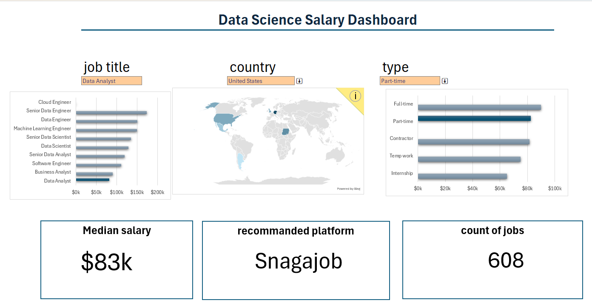

[<button style="background-color:#0074D9;color:white;padding:12px 24px;border:none;border-radius:6px;cursor:pointer;font-size:18px;margin-bottom:18px;"><b>Download Salary Calculator - DATA FIELD.xlsx</b></button>](./salary%20calculator%20-%20DATA%20FIELD.xlsx)

---

## 📝 About the Project

Welcome to the dashboard for exploring the job market in the data field!  
In this project, you can analyze various data science job salaries using an **interactive Excel file**, which allows you to filter information by job title, geographic region, job type, and more.

The dashboard collects and analyzes up-to-date salary data, presenting findings clearly and visually, with emphasis on:
- **Median salary** by position
- **Country breakdown** on an interactive map
- **Job types** (full time, part time, freelance, etc.)
- Recommended job search platform
- Number of relevant jobs displayed

---

## 🖼️ Main Dashboard

*Main dashboard interface: segmentations by job title, country, job type, and key statistics.*

---

## ✨ Key Benefits

- **Great for job seekers, recruiters, and those starting out in the data industry**
- Enables **quick and smart comparison** of salaries and job listings
- Provides **real-time insights** for informed decision making in the job market

---

## 🚀 Getting Started

1. [Download the Salary Calculator.xlsx file](./salary%20calculator.xlsx)
2. Open the file in Excel.
3. Use the filters and tabs to analyze the information according to your needs.

---

Good luck with your job search and professional development!  
👍

